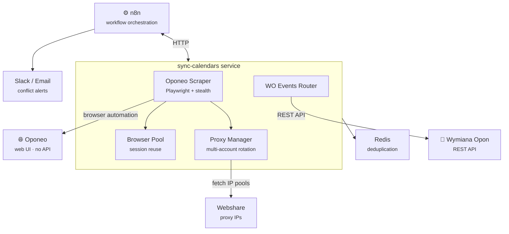

# Sync Calendars

Bidirectional calendar synchronization between two tire service platforms — when there's no API, you build one.


---

## How It Works

<table>
<tr>
<td align="center"><strong>WO → n8n → Oponeo</strong></td>
<td align="center"><strong>Oponeo → n8n → WO</strong></td>
</tr>
<tr>
<td></td>
<td></td>
</tr>
</table>

## The Problem

A tire service client uses two booking platforms simultaneously — **Oponeo** and **Wymiana Opon (WO)**. Bookings on one platform need to appear on the other to prevent double-bookings, conflicts, and missed appointments. WO has a REST API. Oponeo has none — just a web interface behind authentication.

## The Solution

A TypeScript service that acts as an API layer for the API-less platform, combined with n8n workflow orchestration for bidirectional sync:

- **Browser automation** (Playwright + stealth plugins) extracts reservation data from Oponeo's web interface, navigating authentication, pagination, and dynamic content
- **Rotating proxy infrastructure** distributes requests across multiple IP pools with per-account isolation, preventing detection during hourly scraping cycles
- **n8n workflows** orchestrate the full sync pipeline — polling both platforms, diffing calendars, creating/cancelling reservations, and triggering conflict alerts
- **Smart conflict detection** sends Slack messages and email notifications when overlapping bookings are found or out-of-hours appointments are made

## Key Features

- **Bidirectional sync** — Oponeo ↔ WO, reservations flow both directions
- **Conflict detection & alerts** — Slack + email notifications for overlapping bookings
- **Out-of-hours alerts** — flags appointments booked outside business hours
- **Proxy rotation** — multi-account IP management with blacklisting and usage-balanced selection
- **Browser session pooling** — reuses authenticated sessions with idle timeout cleanup
- **Redis-backed deduplication** — prevents duplicate reservation creation across sync cycles

## Tech Stack

| Category | Technology |
|---|---|
| Language | TypeScript, Node.js |
| Browser Automation | Playwright, playwright-extra, stealth plugin |
| Orchestration | n8n (workflow automation) |
| Cache / Dedup | Redis |
| HTTP Server | Express |
| Validation | Zod |
| Logging | Winston |
| Date Handling | date-fns |
| Containerization | Docker (multi-stage build, tini init) |

## Architecture



## Getting Started

```bash
# Clone and configure
git clone <repo-url>
cp .env.example .env  # fill in credentials

# Run with Docker
docker build -t sync-calendars .
docker run -p 3001:3001 --env-file .env sync-calendars
```

The service exposes endpoints consumed by n8n workflows:
- `POST /oponeo/scraper` — scrape and return Oponeo reservations
- `POST /oponeo/mutator` — create reservations on Oponeo
- `POST /oponeo/obliterator` — cancel reservations on Oponeo
- `GET /wo/events` — proxy WO API events with date filtering
- `GET /health` — health check
