## The Problem

A tire service client uses two booking platforms simultaneously — **[Oponeo](https://autoserwis.oponeo.pl/)** and **[Wymiana Opon](https://wymianaopon.pl/)**. Bookings on one platform need to appear on the other to prevent double-bookings, conflicts, and missed appointments. WO has a REST API. Oponeo has none — just a web interface behind authentication.

---

## The Solution

<table>
<tr>
<td align="center"><strong>WO → n8n → Oponeo</strong></td>
<td align="center"><strong>Oponeo → n8n → WO</strong></td>
</tr>
<tr>
<td></td>
<td></td>
</tr>
</table>

A TypeScript service that acts as an API layer for the API-less platform, combined with n8n workflow orchestration for bidirectional sync:

- **n8n workflows** orchestrate the full sync pipeline — polling both platforms, diffing calendars, creating/cancelling reservations, and triggering conflict alerts
- **Bidirectional sync** — Oponeo ↔ WO, reservations flow both directions
- **Browser automation** (Playwright + stealth plugins) extracts reservation data from Oponeo's web interface, navigating authentication, pagination, and dynamic content
- **Rotating proxy infrastructure** distributes requests across multiple IP pools with per-account isolation, preventing detection during hourly scraping cycles
- **Smart conflict detection** sends Slack messages and email notifications when overlapping bookings are found or out-of-hours appointments are made
- **Redis-backed deduplication** — prevents duplicate reservation creation across sync cycles

## Bird's Eye View

```mermaid
graph TD
    n8n["⚙️ n8n<br/><small>workflow orchestration</small>"]

    n8n --> Alerts["Slack / Email<br/><small>conflict alerts</small>"]
    n8n <-->|HTTP| service

    subgraph service ["sync-calendars service"]
        Scraper["Oponeo Scraper<br/><small>Playwright + stealth</small>"]
        WORouter["WO Events Router"]
        BrowserPool["Browser Pool<br/><small>session reuse</small>"]
        ProxyMgr["Proxy Manager<br/><small>multi-account rotation</small>"]
        Scraper --> BrowserPool
        Scraper --> ProxyMgr
    end

    BrowserPool -->|browser automation| Oponeo["🌐 Oponeo<br/><small>web UI · no API</small>"]
    ProxyMgr -->|fetch IP pools| Proxies["Webshare<br/><small>proxy IPs</small>"]
    Scraper -->|deduplication| Redis["Redis<br/><small>deduplication</small>"]
    WORouter -->|REST API| WO["📡 Wymiana Opon<br/><small>REST API</small>"]
```

